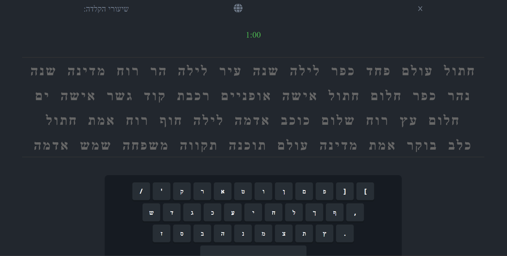
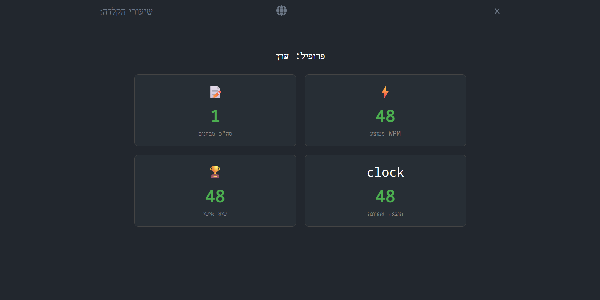

# ⌨️ Hebrew Blind Typing Tutor


> A fully interactive, single-page web application designed to help users master Hebrew touch typing through gamified progression and real-time analytics.

[**🔴 View Live Demo**](https://hessens.github.io/Hebrew-Blind-Typing/login.html)

---

## 📖 About the Project
 
This application was built to solve the challenge of learning the Hebrew keyboard layout efficiently. Unlike standard typing tests, this tool offers a structured curriculum that builds muscle memory key-by-key. It features a custom-built typing engine that handles real-time validation, multi-user progress tracking via LocalStorage, and a dynamic visual keyboard that reacts to user input.

## ✨ Key Features

### 🎮 Interactive Learning Experience
* **Live Virtual Keyboard:** A responsive on-screen keyboard that lights up in real-time, mirroring your physical keystrokes to guide finger placement without looking down.
* **"Keep-Going" Validation:** A smart error-handling system that highlights correct letters in white and errors in red, allowing the user to continue typing naturally without forced stops.
* **Gamified Curriculum:** 8 structured lessons, each divided into 4 difficulty levels (32 total stages), ensuring gradual mastery of the alphabet.

### 🧪 Advanced Testing Suite
Users can challenge themselves with a flexible testing system:
* **Time Attack Mode:** Race against the clock with preset durations (15s, 30s, 45s, 1m, 1.5m, 2m).
* **Word Count Mode:** Focus on endurance with fixed word limits (10 to 100 words).
* **Randomized Content:** The test generator pulls from a diverse "Word Bank" to ensure no two tests are ever the same.

### 📊 User Profile & Analytics
* **Multi-User Support:** Complete authentication system allowing multiple users to create accounts on the same device.
* **Persistent Progress:** Uses `localStorage` to save completed levels (visualized by blue indicators) and user statistics permanently.
* **Smart Dashboard:** Tracks metrics including:
    * **WPM (Words Per Minute):** Calculated based on successfully completed words.
    * **Accuracy:** Tracks deletion counts and error rates.
    * **Personal Bests:** Saves and displays the user's highest WPM record.

## 🛠️ Technical Architecture

* **Core:** Built entirely with **Vanilla JavaScript (ES6+)**, HTML5, and CSS3. No external frameworks were used, demonstrating deep understanding of DOM manipulation and state management.
* **Data Persistence:** Implemented a custom JSON-based storage wrapper for `localStorage` to handle user sessions and data serialization.
* **Dynamic Loading:** Utilizes the JavaScript `fetch` API to modularly load lesson content and components (like the keyboard), keeping the codebase clean and maintainable.
* **Responsive UI:** Designed with CSS Grid and Flexbox to ensure the application works on various screen sizes.

## 🚀 How to Run Locally

Because this project uses the `fetch` API for modular loading, it requires a local server to run (browsers block file-system requests for security).

1.  **Clone the repository:**
    ```bash
    git clone [https://github.com/hessens/hebrew-blind-typing.git](https://github.com/hessens/hebrew-blind-typing.git)
    ```
2.  **Run with Live Server:**
    * Open the project folder in **VS Code**.
    * Install the "Live Server" extension.
    * Right-click `index.html` (or `login.html`) and select **"Open with Live Server"**.

## 📸 Screenshots

| Typing Interface | Profile Dashboard |
|:---:|:---:|
|  |  |
| *Real-time visual feedback and validation* | *WPM tracking and user statistics* |

## 👨‍💻 Author

**Shira Hessen**

* [**LinkedIn**](https://www.linkedin.com/in/shira-hessen-49a96a224)
* [**GitHub**](https://github.com/hessens)


